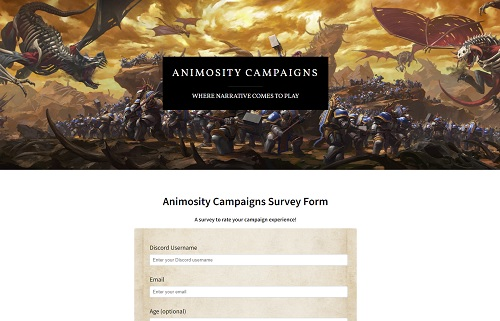

# Responsive Survey Form

This mini project was made as part of the [freeCodeCamp](https://www.freecodecamp.org/learn/) Responsive Web Design certification course. 

The brief was to build a [CodePen.io](codepen.io) Survey Form app that is functionally similar to this: https://codepen.io/freeCodeCamp/full/VPaoNP.

This project was built as a demo for use by [Animosity Campaigns](https://animositycampaigns.com/), an unofficial global narrative campaign for [Warhammer Age of Sigmar](https://ageofsigmar.com/) by [Games Workshop](https://www.games-workshop.com/en-GB/Home)

My original CodePen can be viewed [here](https://codepen.io/nickchapman1988/pen/bGaZQWL)

It should be noted that additional content and styling has been added above and beyond the requirements of the project (namely the header, to match the Animosity main site); however, due to the requirements needed to pass the project, these elements *do not* currently conform to best practices - this would normally be corrected prior to any actual deployment.

In addition, several user stories were specified to be met. These were as follows:

<table>
    <tr>
    <th>STORY ID</th>
    <th>USER STORY</th>
    </tr>
    <tr>
    <td>User Story #1:</td>
    <td>I can see a title with id="title" in H1 sized text.</td>
    </tr>
    <tr>
    <td>User Story #2:</td>
    <td>I can see a short explanation with id="description" in P sized text.</td>
    </tr>
    <tr>
    <td>User Story #3:</td>
    <td>I can see a form with id="survey-form".</td>
    </tr>
    <tr>
    <td>User Story #4:</td>
    <td>Inside the form element, I am required to enter my name in a field with id="name".</td>
    </tr>
    <tr>
    <td>User Story #5:</td>
    <td>Inside the form element, I am required to enter an email in a field with id="email".</td>
    </tr>
    <tr>
    <td>User Story #6:</td>
    <td>If I enter an email that is not formatted correctly, I will see an HTML5 validation error.</td>
    </tr>
    <tr>
    <td>User Story #7:</td>
    <td>Inside the form, I can enter a number in a field with id="number".</td>
    </tr>
    <tr>
    <td>User Story #8:</td>
    <td>If I enter non-numbers in the number input, I will see an HTML5 validation error.</td>
    </tr>
    <tr>
    <td>User Story #9:</td>
    <td>If I enter numbers outside the range of the number input, which are defined by the min and max attributes, I will see an HTML5 validation error.</td>
    </tr>
    <td>User Story #10:</td>
    <td>For the name, email, and number input fields inside the form I can see corresponding labels that describe the purpose of each field with the following ids: id="name-label", id="email-label", and id="number-label".</td>
    </tr>
    <td>User Story #11:</td>
    <td>For the name, email, and number input fields, I can see placeholder text that gives me a description or instructions for each field.</td>
    </tr>
    <td>User Story #12:</td>
    <td> Inside the form element, I can select an option from a dropdown that has a corresponding id="dropdown".</td>
    </tr>
    <td>User Story #13:</td>
    <td>Inside the form element, I can select a field from one or more groups of radio buttons. Each group should be grouped using the name attribute.</td>
    </tr>
    <td>User Story #14:</td>
    <td>Inside the form element, I can select several fields from a series of checkboxes, each of which must have a value attribute.</td>
    </tr>
    <td>User Story #15:</td>
    <td> Inside the form element, I am presented with a textarea at the end for additional comments.</td>
    </tr>
    <td>User Story #16:</td>
    <td> Inside the form element, I am presented with a button with id="submit" to submit all my inputs.</td>
    </tr>
</table> 